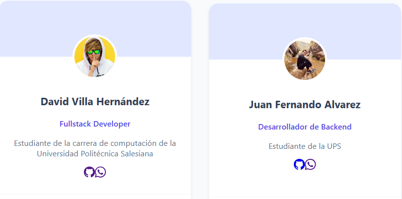

## **EQUIPO DEL PROYECTO**


## **Integrantes**

**Git Proyecto**: https://github.com/Juanfernando518/Proyecto--Interciclo.git

- David Villa

**Git Personal**: https://github.comDavidvillahdz

- Juan Alvarez 

**Git Personal**: https://github.com/Juanfernando518?tab=repositories

## **Tecnologías Utilizadas**
 A continuación se muestran las tecnologías principales empleadas para el desarrollo del Portafolio Administrativo, junto con sus respectivos logos y una breve descripción de su utilización dentro del proyecto.

 **Angular**

 

 Se utilizó para construir toda la interfaz del usuario, las rutas, componentes, servicios, guardas de autenticación y todo el consumo hacia Firebase.

 **Firebase**


Firebase se empleó como backend serverless para:

- Firebase Authentication: Inicio de sesión con Google y con correo/contraseña.

- Firestore Database: Almacenamiento de usuarios, roles, solicitudes y datos del sistema.

- Hosting (si aplica): Posible despliegue del proyecto.

**EmailJS**

Utilizado para enviar correos automáticos desde el sistema sin necesidad de un backend personalizado.

Se empleó para notificar solicitudes o envíos automáticos desde formularios.

**WhatsApp**


Permite enviar mensajes directos desde el sistema para para ver si su cita fue aceptada o rechazada.

**HTML5 + CSS3**

 

Usados para la estructura visual, estilos personalizados, páginas responsivas y diseño general.

**TypeScript**


Lenguaje principal del desarrollo en Angular. Permite tipado estricto, servicios, interfaces, modelos y programación modular.

## **Descripción del Proyecto**

Describe el desarrollo y fundamentos del sistema DevPortafolios, una 
plataforma web construida en Angular e integrada con Firebase, diseñada para la gestión 
de programadores y el registro de solicitudes de asesorías. El enfoque del desarrollo se 
centró en crear un entorno accesible, seguro y escalable que permita a los usuarios 
interactuar con perfiles profesionales, solicitar asesorías y gestionar información en 
tiempo real. Además, se incorporaron decisiones técnicas orientadas a mejorar la 
experiencia del usuario, optimizar el rendimiento y garantizar un correcto 
almacenamiento de datos e imágenes

## **Roles y Funcionalidades** 
El sistema está diseñado con tres roles principales, cada uno con permisos y accesos específicos dentro del portafolio administrativo. Estos roles permiten controlar qué acciones puede realizar cada usuario según su función dentro del sistema.

**Administrador**

El Administrador es el usuario con mayor nivel de acceso dentro del sistema. Puede gestionar todos los módulos y supervisar el funcionamiento general.

Funcionalidades principales:

👤 Gestión completa de usuarios
Crear, editar y eliminar usuarios del sistema.

🛡️ Gestión de roles
Asignar o modificar roles (Administrador, Programador, Usuario).

📝 Revisión y aprobación de solicitudes
Ver solicitudes creadas por los usuarios y aprobarlas/rechazarlas.

📊 Acceso al panel administrativo
Dashboard especializado con estadísticas, registros y vista general del sistema.

⚙️ Edición de módulos internos
Puede acceder a configuración avanzada e información técnica que los otros roles no ven.

**Programador**

El Programador tiene acceso al área técnica del sistema. Puede ver, revisar y actualizar datos internos según los permisos que el Administrador otorgue.

Funcionalidades principales:

🛠️ Acceso al módulo técnico
Panel donde puede trabajar en solicitudes o proyectos internos.

🧩 Edición de proyectos y solicitudes
Puede modificar información del sistema dependiendo del área asignada.

🔧 Mantenimiento de datos del sistema
Actualización de registros y soporte a módulos creados por administradores.

🔒 Acceso limitado según permisos
No tiene el control total que posee el Administrador.

**Usuario General**

Es el usuario final del sistema. Tiene acceso a funciones esenciales para interactuar con el portafolio administrativo.

Funcionalidades principales:

📝 Crear nuevas solicitudes
Puede enviar solicitudes que se almacenan en Firebase y quedan pendientes de revisión.

👀 Visualizar el estado de las solicitudes
Puede ver el estado: “En revisión”, “Aprobada”, “Rechazada”.

✏️ Actualizar datos personales
Editar parte de su información de usuario según el rol asignado.

📩 Recibir notificaciones por WhatsApp

## **Módulos y Pantallas del Sistema**  

El sistema cuenta con una arquitectura basada en roles y pantallas específicas que se habilitan según el tipo de usuario.
A continuación se describen todos los módulos implementados según los requisitos del proyecto:

🔐 1. Autenticación y Roles

Pantalla inicial del sistema donde se permite el acceso mediante:

- Inicio de sesión con Google usando Firebase Authentication.

- Detección automática del rol del usuario (Administrador, Programador o Usuario General).

- Redirección automática al panel correspondiente según permisos.

Funciones destacadas:

- El Administrador puede acceder a módulos de gestión.

- El Programador ingresa a su portafolio personal.

- El Usuario normal puede explorar portafolios y agendar asesorías.

👥 Gestión de Usuarios (Administrador)

Módulo exclusivo para el rol Administrador.

Permite gestionar completamente a los usuarios programadores:

- Registrar nuevos programadores.

- Editar información básica.

- Eliminar cuentas.

- Asignar roles.

Administrar datos del portafolio del programador:

- Nombre completo

- Especialidad

- Resumen o biografía

- Foto de perfil

- Enlaces de contacto y redes sociales

Este módulo se encuentra conectado directamente a Firebase Firestore para persistencia en tiempo real.

**💼  Gestión de Portafolios y Proyectos (Programador)**

Cada programador cuenta con un portafolio individual, accesible tanto por él mismo como por usuarios externos.

Dentro del portafolio se manejan proyectos divididos en dos categorías:

📘 Proyectos Académicos
 
 - Proyectos desarrollados dentro del ciclo académico.

 💼 Proyectos Laborales / Simulados

 - Proyectos profesionales o de práctica.

**Cada proyecto contiene:**

- Nombre del proyecto

- Descripción detallada

- Tipo de participación (Frontend, Backend, Base de Datos)

- Tecnologías utilizadas

- Enlace al repositorio (GitHub u otros)

- Demo o despliegue (Firebase Hosting, Vercel, etc.)

**El programador puede:**

- Crear nuevos proyectos

- Editar su información

- Eliminar proyectos antiguos

- Organizarlo todo dentro de su portafolio

**📅 4. Gestión de Asesorías**

Módulo para la administración y coordinación de asesorías entre programadores y usuarios.

**Acciones del Administrador:**
- Registrar horarios de disponibilidad de cada programador.

**Acciones del Usuario Normal:**
- Acceder al botón “Agendar Asesoría” desde la página principal.

Seleccionar:

- Programador disponible

- Fecha y hora

- Mensaje o motivo opcional
  
**Acciones del Programador:**

* Contar con una sección llamada “Asesorías” en su panel.

* Visualizar solicitudes entrantes.

* Aprobar o rechazar asesorías.

* Enviar un mensaje de confirmación o justificación.

**🎨 5. Diseño de Interfaz y Prototipo (UX/UI)**

El sistema cuenta con una interfaz moderna, limpia y totalmente responsive.

Características:
 
* Prototipo validado con principios de UX/UI.

* Compatibilidad con dispositivos móviles, tablets y escritorio.

* Diferenciación visual entre:

* Panel del Administrador

* Panel del Programador

* Vista del Usuario Externo

* Componentes reutilizables de Angular y estilos personalizados.

**🔔 6. Notificaciones**

El sistema integra un flujo de comunicación interno basado en Firebase.

**Notificaciones del Programador:**

* Recibe las nuevas solicitudes de asesoría en su panel personal.

**Notificaciones del Usuario:**

 * Recibe mensajes de:

* Solicitud aprobada

* Solicitud rechazada

* Comentario del programador

**Simulación externa:**

* Flujo compatible con notificaciones simuladas vía:

* EmailJS (correo)

* WhatsApp API (mensaje automatizado)

## **Flujos Principales del Usuario** 

Se describen los flujos esenciales dentro del sistema, explicando cómo interactúan los usuarios, qué acciones realizan y cómo se procesan los datos en Firebase.

**Flujo de Inicio Sesion**

1. El usuario accede a la pantalla de Login.

2. Selecciona la opción “Iniciar sesión con Google”.

3. Firebase Authentication valida el correo y genera el uid del usuario.

4. Si es la primera vez, se crea automáticamente un documento en la colección usuarios, con:

* nombre

* correo

* foto

* rol por defecto: "usuario"

* fecha de registro

5. El usuario es redirigido a su Dashboard según su rol:

* Administrador → Panel administrativo

* Programador → Panel técnico

* Usuario general → Vista general de solicitudes/proyectos

**Flujo del Usuario General**

1. Desde su panel puede:

* Crear una nueva solicitud o requerimiento.

* Ver el historial de solicitudes enviadas.

* Actualizar su perfil.

* Adjuntar información adicional.

2. Cuando envía una solicitud:

* Los datos se guardan como un documento en solicitudes.

Se registra:

* id_usuario

* fecha

* descripción

* estado = "pendiente"

Se envía una notificación al Administrador (si está configurado con EmailJS o Cloud Functions).

**Flujo del Administrador**

1. Al iniciar sesión, el Administrador ingresa directamente al Dashboard Admin.

2. Puede realizar:

* Gestión de usuarios (crear, editar rol, suspender).

* Gestión de proyectos.

* Revisión, aprobación o rechazo de solicitudes.

* Visualización de reportes o métricas.

3. Al cambiar el estado de una solicitud:

* Se actualiza el documento en la colección solicitudes.

* El usuario recibe notificación (si está configurado).

**Flujo del Programador**

1. Al iniciar sesión, accede al Panel Técnico.

Funciones disponibles:

* Ver solicitudes asignadas.

* Editar, programar o dar mantenimiento a proyectos.

* Subir archivos o documentación técnica.

2. Al actualizar un proyecto o solicitud:

* Cambia el documento dentro de proyectos o solicitudes.

* Se guarda registro de actividad con fecha y autor.

**Flujo de Gestión del Perfil**

1. El usuario abre la pantalla Perfil.

Puede actualizar:

* Información personal

* Foto de perfil

* Datos de contacto

2. Los datos se guardan en la colección usuarios usando su uid.

**Flujo de Cierre de Sesión**

* El usuario selecciona Cerrar sesión.

* Firebase Authentication invalida la sesión actual.

* El sistema redirige nuevamente al Login.

## **Fragmentos Técnicos Importantes**  

Se muestran algunos fragmentos clave utilizados dentro del sistema para manejar funcionalidades principales como el envío de correos automáticos, guardado de datos en Firebase y envío de mensajes vía WhatsApp.

**Envío Automático de Correos (EmailJS)**

 ```bash
import emailjs from "@emailjs/browser";

emailjs.send(
  "service_id",
  "template_id",
  {
    programmer_name: data.programmer,
    requester_name: data.user,
    date_time: data.fecha,
    comment: data.comentario
  },
  "public_key"
);

  ```
  **Guardado de Solicitudes en Firebase (Firestore)**

  ```bash

  import { addDoc, collection } from "@angular/fire/firestore";

await addDoc(collection(this.firestore, "solicitudes"), {
  usuario: user.uid,
  programador: programmer.id,
  fecha: fecha,
  comentario: comentario,
  estado: "pendiente"
});
```

**Registro  de Notificación por WhatsApp**
```bash
this.firestore.updateDoc(`solicitudes/${id}`, {
  whatsappNotified: true,
  mensaje: "El programador ha recibido tu solicitud vía WhatsApp."
});
```
##  **Conclusiones**

El desarrollo del Portafolio Administrativo permitió integrar múltiples tecnologías y módulos funcionales en un solo sistema, logrando un flujo completo de administración, gestión de usuarios, portafolios, solicitudes y asesorías. A continuación, se resumen los principales logros y aprendizajes obtenidos durante el proyecto.

### ✅ **Logros del Proyecto**
- Implementación exitosa de Autenticación con Google mediante Firebase Authentication.
- Desarrollo de un sistema con roles diferenciados (Administrador, Programador, Usuario) y control de acceso.
- Construcción de paneles independientes para cada rol, con interfaces intuitivas y responsivas.
- Gestión completa de usuarios programadores, incluyendo información profesional y portafolios individuales.
- Creación de un sistema de solicitudes de asesorías con seguimiento y actualización de estados.
- Integración de Firebase Firestore para almacenamiento en tiempo real.
- Flujo simulado de notificaciones internas y uso de herramientas externas (EmailJS / WhatsApp).
- Implementación de buenas prácticas de UX/UI en cada pantalla del sistema.

### 📘 **Qué se Aprendió**
- Manejo avanzado de Angular + Firebase para la construcción de aplicaciones web serverless.
- Gestión de roles y permisos utilizando patrones de diseño y guards de autenticación.
- Uso de Firestore para:
  - Lectura en tiempo real
  - Creación, actualización y eliminación de documentos
- Diseño modular profesional basado en:
  - components/
  - pages/
  - core/services/
  - modules por rol
- Implementación de flujos administrativos completos:
  - CRUD de usuarios
  - Solicitudes y aprobaciones
  - Portafolios dinámicos por usuario
- Integración de APIs externas (EmailJS y WhatsApp).
- Optimización visual aplicando principios de UX/UI y diseño responsive.

### 🚀 **Posibles Mejoras Futuras**
- Implementar un sistema real de notificaciones por correo y WhatsApp usando servicios externos oficiales.
- Añadir un módulo de estadísticas avanzadas para los administradores.
- Incorporar un calendario visual para la gestión de asesorías.
- Mejorar la personalización del portafolio de cada programador (temas, colores, plantillas).
- Agregar un chat interno entre programadores y usuarios.
- Crear una app móvil complementaria usando Ionic o Flutter.
- Implementar storage para carga de archivos y evidencias de proyectos.
---


